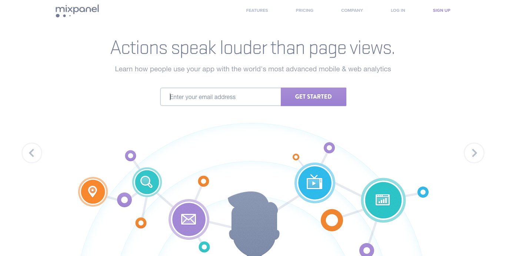
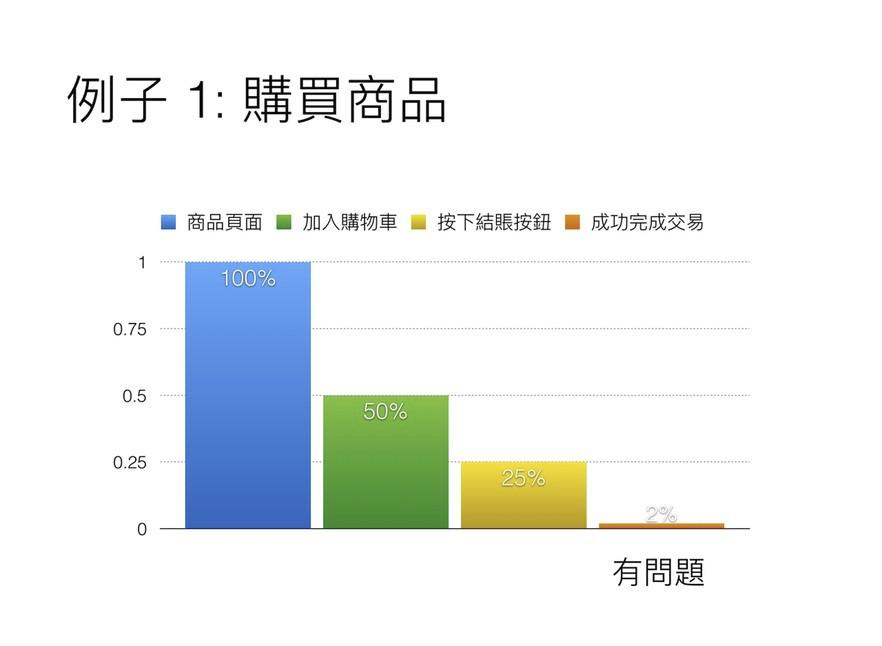
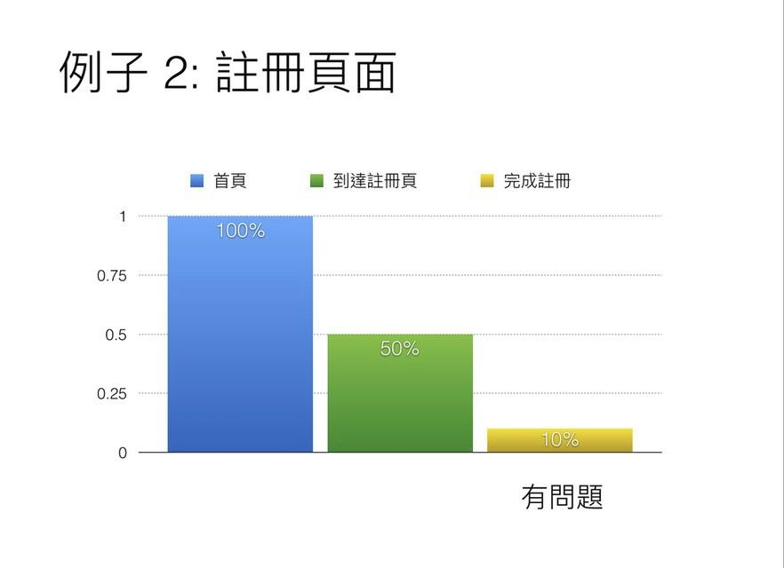
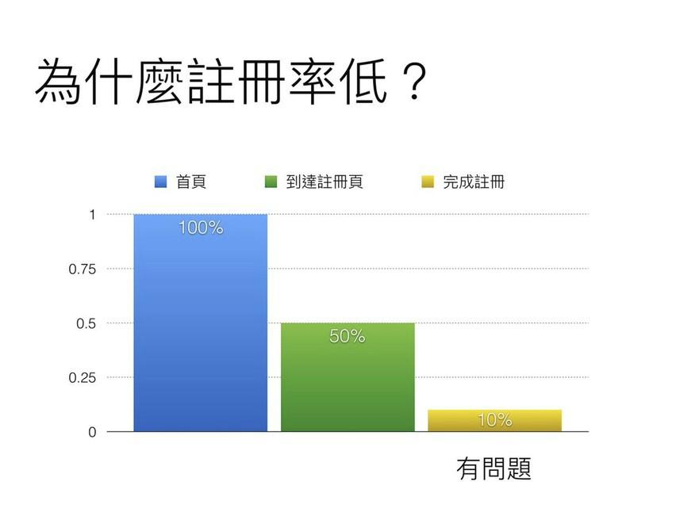
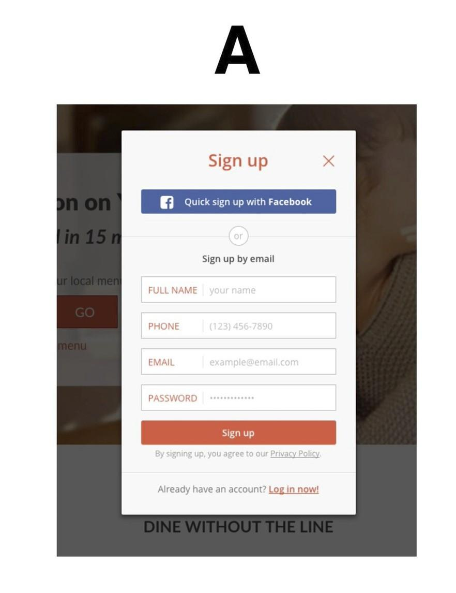

# 第3章 科學方法抓銷售漏洞

前面兩個章節，我們討論了以「成長」為目標的意義，也分析了成長駭客方法在AARRR銷售漏斗上進行改進的策略模型，但是要開始成長駭客手段前，我們千萬要記住，不能只是學會所謂成長駭客的「結果手段」，因為所有Growth
Hack方法都立基於一個核心前提：數據分析與量化指標上！

（跨兩頁，黑底白字）

## 第7課 制定成長策略前，一定先監控測量
--------------------------------------------

--- 沒有數據分析與量化指標，就不是成長駭客

成長駭客策略有一個基本的前提：

> Measuring before building a Growth Engine。

從前面的行銷漏斗概念中，我們了解了基本的轉換率改善技巧，那麼是不是直接就開始改善每一個行銷漏斗環節就好呢？

一來我們沒有那麼多預算和時間可以每一個環節都改進，二來我們怎麼知道改進這個環節到底是吸引用戶還是排除用戶。

### 什麼都想改進，結果什麼都退步

但是在傳統的產品改善過程中，大部分團隊都不會思考這個問題，而常會接著作出這樣的決策：

購買率降低了！

那就趕快進行產品頁面改版。

註冊率偏低！

那就趕快進行首頁改版。

但往往花了大把資源投入後，後續卻發現成效都不好，甚至還出現「成長倒退」的現象。
為什麼？

這是因為在傳統的分工中，大多數的團隊是基於「直覺」、「團隊喜好」或者是「開發者個
人喜好」去做產品調整。但卻不是「科學證據」。

### 成長駭客，講求科學證據

你可以把「Measuring」想像成實體店鋪的「監視器」。

在進行店鋪體質改善工程之前，我們其實不該貿然的就跳下去進行大刀闊斧的改善工程，因為我們不知道現在店面到底是哪裡讓顧客不滿意，我以為是牆壁顏色問題，於是重新粉刷後，才發現原來是掛的海報的問題，這樣不是白花錢了嗎？

所以應該先掛上「監視器」，監測出公司的銷售漏斗，實際上哪個環節出了什麼問題。

### Measuring工具與原理

一般來說，講到量測工具，大家直覺會想到的是Google Analytices。

不過在成長駭客這個領域，其實我們比較常使用的是「Mixpanel」這一類的量測工具。

Mixpanel與Google Analytics不同的地方在於：Google Analytic 較偏向追蹤
pageview（頁面瀏覽數字），Mixpanel則偏向事件觸發。而後者這樣的模式，有利於開發者精確作出產品內的銷售漏斗渠道分析。

[Mixpanel](https://mixpanel.com/)

## 第8課：跟你想的不一樣，找出成長問題案例解析
---------------------------------------------------

--- 別再相信通靈與各自為政，讓科學方法找出問題所在

什麼是渠道分析？下面我用幾個實際案例來解釋。

### 購物商城的渠道分析案例一

後面這是一個購物商城的整個購買渠道步驟，分爲四個步驟。

進入商品頁面 =\> 加入購物車 =\> 按下結賬按鈕 =\> 成功完成交易。

傳統的後台，我們通常只能獲得一個最終結果：就是成交的數量不高，可是到底哪個環節出問題呢？這時候就要安裝測量工具，實際看看用戶在網頁裡的每一個操作步驟裡，到底哪一個步驟轉換率最低？

很多團隊改版網站的過程，很像是通靈一樣。

業務團隊覺得是產品在網頁上的敘述不夠鮮明，要求改善。

產品團隊覺得是購物車操作動線不夠流暢，要求改善。

工程團隊覺得購物車按鈕顏色不對，自己想要改善。

大家吵成一團。但實際上問題在哪裡呢？從後面這份測量工具間空出來的報表圖，我們才能真正看出問題根本不在產品頁面或者是購物車上。

利用量測工具跑出來的報表，你會發現在「成功完成交易」這一個步驟有問題。

當顧客把商品加入購物車的比例很高，按下結帳的按鈕比例也很高，但是最後一個要成功完成交易時的量，
卻瞬間掉到只有2%而已。（轉換過程流失用戶是正常的，但過度的流失比例，就是問題癥結）

這表示可能在「成功完成交易」的步驟那一段有問題，有可能是：

信用卡結賬失敗？

寄送地址步驟填寫太過麻煩？

但總之影響公司業績的原因，絕對不會是在我們一開始所以為的「產品頁面」與「購物車按鈕設計/位置」。所以測量工具先有了，我們才知道成長駭客策略要用在什麼地方。

### 網站註冊的渠道分析案例二

後面我們換個例子，這是一個網站的註冊流程，分爲三個步驟，我們透過渠道分析來看看用戶流失的問題點在哪裡。

進入首頁=\> 按下註冊按鈕到達註冊頁 =\> 完成註冊

很多服務的註冊率不佳，但卻沒有掛上監視器來抓出具體問題。

於是內部就會開始檢討是否Landing
Page不夠漂亮？還是文案是不是哪裡不夠吸引人？開始花很多心思去改文案，還真的像是成長駭客教你的方法那樣去跑A/B
Testing，但是最後還是沒有效果。

為什麼？因為我們自以為的問題，常常都不是真正的問題所在。

但用量測工具報表跑出後面的圖表後，其實病灶就很明顯。

原來是在「 完成註冊」註冊這一階段就出了問題！

顧客到了首頁之後，很願意按下「前往註冊」的按鈕，但是最後完成註冊比例很低。
這表示你可能要改進的是你的「註冊表單」，而不是首頁的文案。

### 學成長駭客方法前，要先知道真正問題出在哪？

> 產品要能夠成長，必須要先抓到「具體漏水」的地方。

這樣才能治本，而不是通靈找藥，就想消除症狀。

Growth Hack建立在「數據分析」和「量化指標」的基礎上，所以雖然Growth
Hack有非常多具體改善手段，但請千千萬萬記得一件事：Growth Hack
是建立在「數據分析」和「量化指標」的 「科學改善」之上！

如果沒有引入「數據分析」和「量化指標」，充其量只能叫做「產品轉換率改善」，而不能稱之為「Growth
Hack」。

## 第9課：產品成長三部曲，用數據分析抓出改善病因
-----------------------------------------------------

--- 成長駭客方法通用的三大步驟流程，你一定要學起來

下面我用一個我親身經歷過的產品實際改善例子，來跑一遍數據分析抓銷售漏洞的過程。

當時我們的產品經過了一段時間，註冊率開始降低。

### Step 1: 使用Mixpanel抓出Funnel斷點

我們實際改善的方式就是開Mixpanel，檢討Funnel（銷售漏斗）哪邊出了問題。結果發現在完成註冊的階段，完成率非常的低。

### Step 2：推測可能原因

團隊開始猜想是哪邊出了問題。通常「完成註冊率」很低的問題，在於註冊表格讓顧客「沒
有耐性填完表格」，或「感到對註冊過程有疑慮」。

但是當時我們的註冊表單已經非常簡單，看不出究竟哪一部份讓顧客沒有耐性填完表格。

### Step 3 : 針對假設實作解法，進行A/B Testing

但是我們經過研究後，發現矽谷其他的產品，在註冊表格旁，都加了註冊此服務的好處！

於是，我們猜想這個方法可能會有效，便開始使用A /B
Testing工具（後面章節都會陸續教到），實作了兩版註冊頁：

A版：僅有註冊表格。

B版：註冊表格+註冊好處。

結果放到網站上面實際測試，一個禮拜後，就發現加了「註冊好處」後，註冊率顯著的上
昇。

## 第10課：成長駭客萬用招數：增強信心、降低疑慮
----------------------------------------------------

--- 手法千百種，但把握成長駭客的核心精神就對了！

做 Growth Hack
第一件事：就是在網站上面先裝監視器，先抓出到底是什麼因素去影響你的
業績，然後再對症下藥。

### Growth Hack三大步驟

所以在進入後面幾個章節的成長駭客實戰做法前，還是要再次提醒大家，成長駭客不可或缺的前置數據分析作業，真正的Growth
Hack三大步驟就是：

1. 使用量測工具，抓出 Funnel 斷點
2. 進行研究，推測可能成因
3. 針對假設實作解法，進行A/BTesting

很多人做網站的一個盲點，就是有問題，大家就聚在一起開一個會議，互相罵來罵去，這也是我有以前在網路公司最常看到的溝通問題。

所以為什麼這個章節很重要？Growth Hack是什麼，Growth Hack其實就是必須透過數據分析跟量化指標，你才可以好好真的知道怎麼樣改善你的產品。

為什麼營收低？是來客率低？還是想註冊的人少？還是真正完成註冊的流程太麻煩？到底是表單註冊有問題？還是說明不夠有力？有問題不是很盲目去做大改版，其實只是利用測量工具去量化分析，後用AB測試去找出最佳解答。

所以做Growth Hack第一件事，你必須在你網站上面先裝監視器，才能有效測出這到底是什麼因素去影響你的業績。

### 抓出問題點後，要如何推測改善方案？

看完前幾個章後，再回去網路 Google「Growth Hack」這個關鍵字後，你開始會發現，在還不知道原理之前，「Growth Hack」的資訊少得可憐。

在知道原理之後「Growth Hack」的資訊多到爆炸，就像本書後面也將陸續介紹許多實作成長駭客的方法，例如：

-   Landing Page
-   A/B Testing
-   Content Marketing
-   Customer support
-   Measuring
-   Onboarding
-   Referral
-   Gaminification

看都看不完！更不知道要從何入手。

這裡我整理了一個成長駭客重要的法則，萬變不離其宗，無論你想用什麼方法，遇到什麼問題，其實成長駭客衷旨只有兩句話而已：

* 增強信心
* 降低疑慮

至始至終只要記得這兩句話作為判斷的原則就可以了。
這兩句原則，你會在整本書中，都看到他們的身影。
