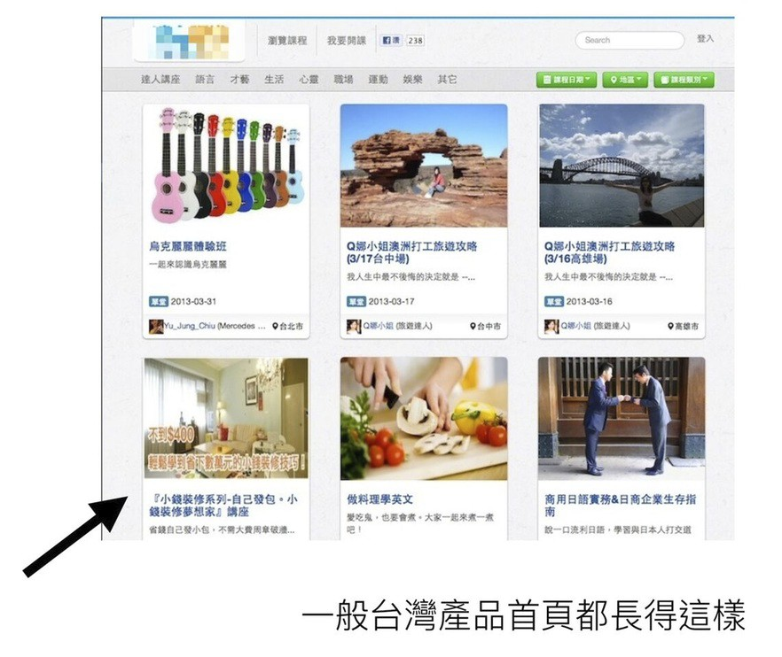
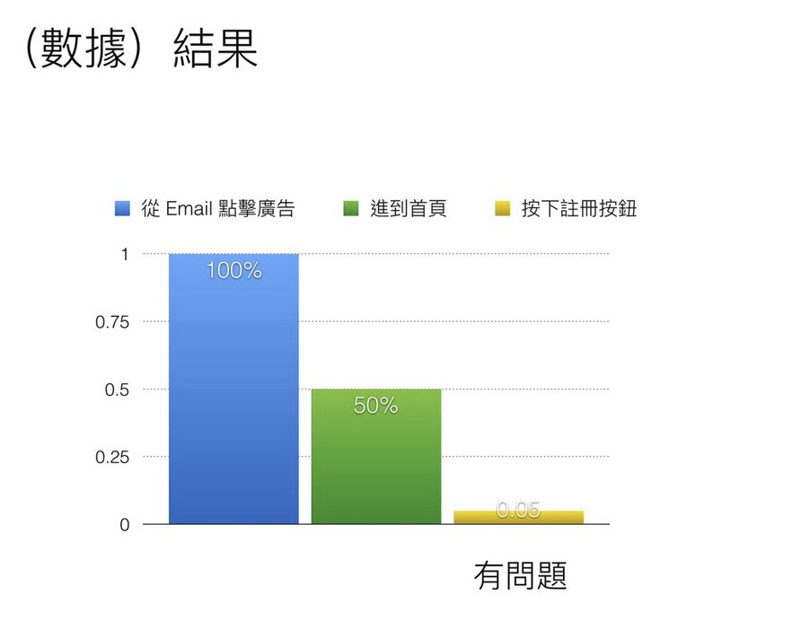
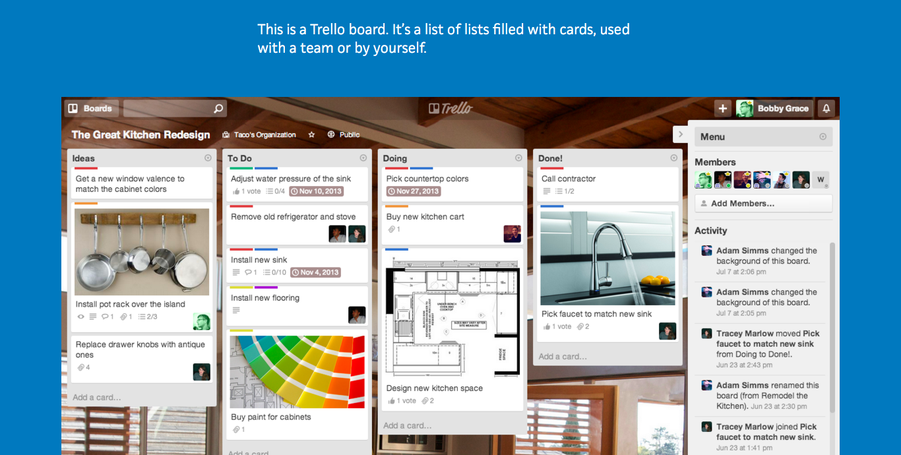
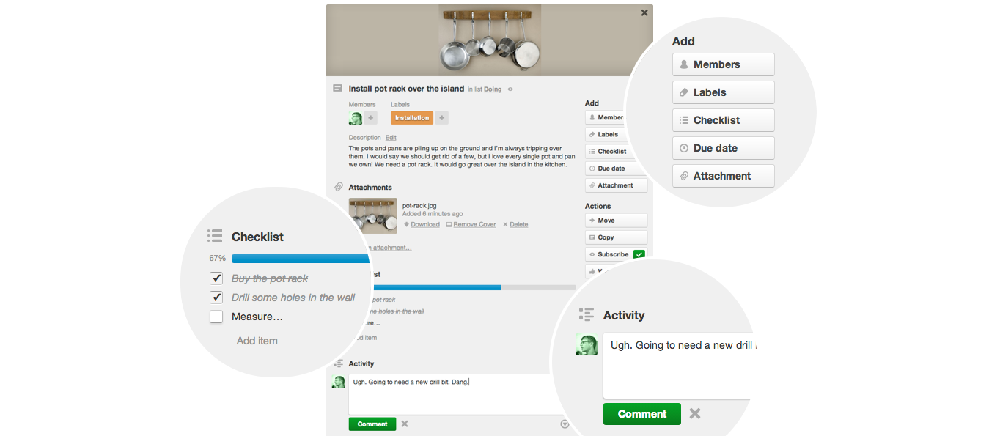
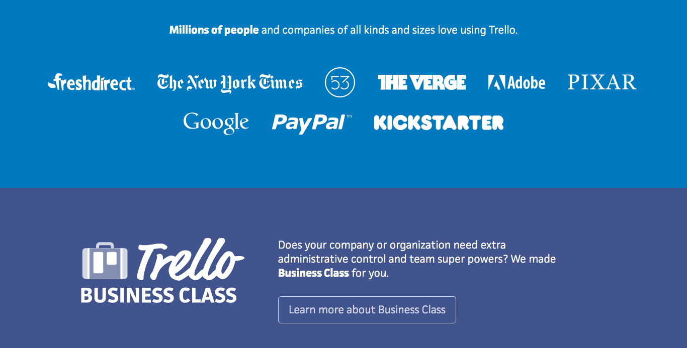
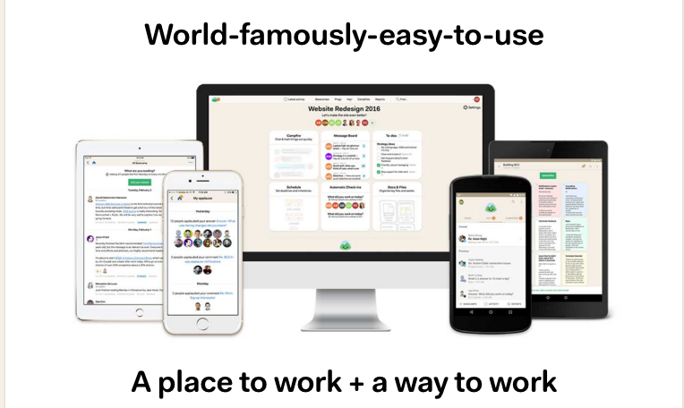
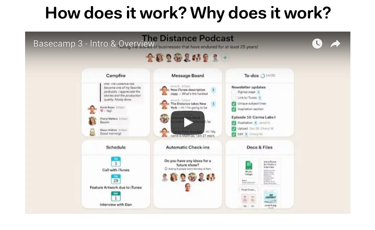
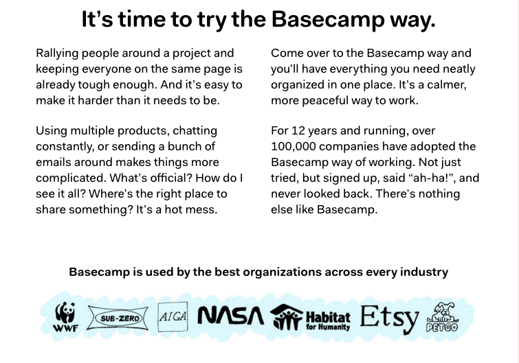
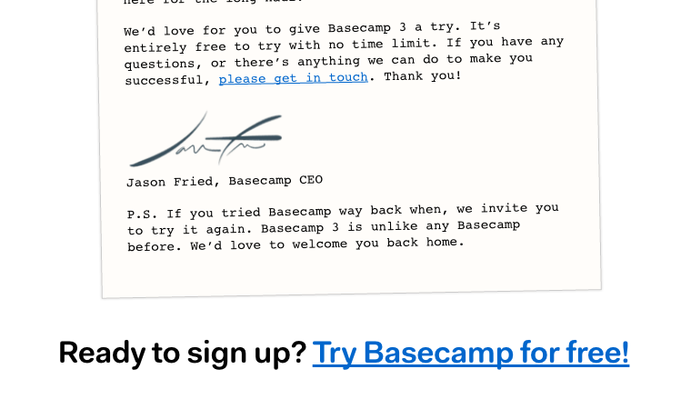

# 第4章：Landing Page：如何打造魅力招牌？

經過了前面的測量後，如果發現你的廣告雖然吸引了很多來客，但是來客進入你的網頁後都不採取行動，那麼這時候你要思考的就是你的Landing
Page設計是不是有問題？而許多國外遵循成長駭客模式的網站，其實有衍伸Landing
Page的基本架構，就讓我們一起來實戰演練一番。

## 第11課：說服顧客採取行動，最重要最關鍵的第一步

--- 為什麼你需要Landing Page？以及這和你想像的首頁其實不一樣！？

如果用實體商舖的概念來解釋，上一章討論的Measuring，和這一章所說的Landing
Page，分別可以解釋成：

* Measuring : 監視器
* Landing Page：招牌

如果我們把MEASURING 比擬爲「監視器」的話，那麼Landing Page就是「招牌」。

### 什麼是Landing Page？

網站營運上，Landing Page就是指顧客點擊「行銷頻道」（如FB廣告、Email\...等等）上的連結後，「著陸」（Landing ）的頁面。

也就是指使用者進入你的服務的第一頁，他有可能是你的官方首頁。但如果是賣商品的話，通常人家進去你的第一個頁面，就是產品頁。或者如果對方是報名網路上的課程活動的話，其實很少會到你的公司首頁，報名者通常就是直接到報名頁，而這時候報名頁就是Landing Page。

所以，Landing Page可能會是：

-   首頁
-   註冊頁
-   報名頁
-   購買商品頁
-   軟體下載頁

### Landing Page的目標是什麼？

看不同行銷手段，會有不同的Landing Page，但無論如何這一頁的「目標」都在：

說服顧客，希望他們可以進行你指定的動作。

這些你想要導引顧客採取的行動通常會是：

-   購買付費
-   註冊帳號
-   進行軟體下載
-   填寫Email
-   訂閱電子報

於是重點來了，那我們要怎麼設計Landing
Page，來客才願意採取下一步行動呢？這就是我們這一章要一一跟大家分享教戰的重點。

## 第12課：轉換率不佳？因為你忽略了Landing Page
----------------------------------------------------

--- 來客經過你的服務，不代表他就一定會想要進入你的店面！

Landing
Page的問題其實也是本書一開始說的問題，為什麼廣告費用高，轉換率卻不高？我在台灣見過許多的經典例子是像下面這樣：

委託行銷公司狂投廣告，連結就直接指到產品網站（有可能是商城，或者是服務首頁），但成效非常差，因為廣告而進來的大量來客，卻在實際註冊與購買上的轉換率都相當低。

為什麼會有這樣的情形呢？下面我舉一個實際的例子。

### 你為什麼不想進去這家店？

這是我在網路上隨手GOOGLE到的一個例子。

如果你在路上逛街時，逛到後面圖片這樣一家小吃店，裡面只有擺幾張桌子椅子，沒有菜單也沒有價目表，你會進去消費嗎？

我想大多數人的答案都是：不會。

### 不好的店面，提高顧客的疑慮

為什麼你不想進去那樣一家店，因為店面讓你有下面的感覺：

-   不知道這是不是一家店？
-   不知道裡面賣什麼？
-   不知道吃一頓飯花我多少錢？
-   不知道店家手藝好不好？

看出問題點了嗎？

店面醜不醜到還是其次，最重要的是這樣一個什麼都沒說明的店面，讓顧客心中「充滿疑慮」，這就違反了我們前面所說的成長核心精神就是要先降低顧客疑慮。

### 那不好的Landing Page呢？

有了店面的概念，現在我們來看看網站的例子。

這是我一個朋友之前創業失敗的網站的例子，主題是經營一個上課平台。

台灣大家做網站的習慣，就是把產品內容直接揭露出來，要使用者一進來就開始「使用」，卻不做任何引導，這樣就算完成一個網頁，然後就開始投廣告說這是我要賣的東西，這其實是跟上一段小吃店的情形差不多。

大家看到這個首頁，首先會浮出一些疑問：

-   這裡是一個免費上課平台，還是付費上課平台？
-   這個課可以帶來給我的價值是什麼？
-   是線上，還是線下課程？
-   老師是從哪裡來的？
-   老師不開課了要怎樣退錢？
-   我要如何成為老師？
-   怎麼拆帳？
-   這平台是誰開的，會不會倒？

看到這個網站頁面。 消費者會滿腹疑慮，沒有信心。

### 不是廣告投不夠，而是對顧客的說服不夠

這就是為什麼台灣大多數的網站服務轉換率不是很高的原因，因為大家好像裸體在路上走一樣，使用者一進來就被迫自己去了解這個服務的價值與使用方法，於是當然充滿疑慮的人就紛紛離開。

這就是為什麼網站服務的數據結果變成下圖這樣的原因，明明寄出了很多EDM，但是卻沒有人願意註冊使用。

從這個數據圖表，你可以觀察到：

其實很多人願意開信，也不少人點擊連結。

但為什麼後面轉換率很低？

就是因為這些人一進入網站，第一眼看到像空城一般的頁面，且感覺不到任何價值，最後關掉頁面就離開了。

所以如果你的服務轉換率不佳的話，第一個該考慮的就是幫你的服務，或者是「轉換步驟」，
補個「有效的」Landing Page。

Landing Page不僅是「首頁註冊」需要，其實是：

> 任何「說服顧客」產生行動的頁面都需要。

比如：

-   軟體下載
-   商品購買
-   Referral
-   註冊等等...

所以下次做網站，不要以為只要把該有的頁面設計出來就好，要提高轉換率，更重要的是設計出獨一無二的Landing
Page！

## 第13課：Landing Page如何設計？標準結構案例與實戰
--------------------------------------------------------

--- 看看經典服務的Landing Page都是如何打動他們的來客？

如果常逛國外的網站，其實你會發現國外服務的產品頁，通常逛起來都會非常舒服順暢。

這
不是因為國外美術設計的功力功底的緣故，而是因為他們的產品頁使用「Landing
Page」 結構撰寫，這已成國外網站的「標準配備」了！

### 標準的Landing Page結構

Landing
Page的基本結構可以分成六大塊，如果你一時想不到更好的設計，那麼依照這個標準結構做，就可以有一定的效果，他們分別是：

-   用一句話形容自己
-   使用這個服務（產品）的三大好處
-   敘述服務的運作原理或製作示意圖、示意影片
-   加上使用者見證或媒體報導
-   CALL TO ACTION（呼喚來客行動的按鈕）
-   強化信心的補充：免費註冊或退款保證

注意 ！Landing Page的順序也很重要，如果從國內外成功案例來看，請務必先照此順序設計，否則無效。

### 實戰例子1：專案管理工具Trello的Landing Page

Trello是一個相當方便的專案管理工具，很受用戶喜愛。

但是這樣一個全新概念的專案管理服務，是如何說服他人去使用呢？他們的Landing Page其實也就是跟隨上述的「說服顧客」標準流程。

下面讓我們來看看Trello怎麼做？

#### 一句話形容自己：

一打開Trello的首頁，我們可以看到他不是展示功能，而是先用一句關鍵的話來吸引用戶，他說：「這個服務讓任何人用免費、靈活、視覺化的方式組織任何東西。」

把這個服務最吸引人的效果，用有魅力的語句描述出來，即使還不太了解這個服務到底在做什麼的人，也會因為看到那個效果的描述，而想要更進一步捲動網頁瞭解看看。

{width="6.267716535433071in"
height="4.013888888888889in"}

\@圖：part4-4

#### 使用此服務的好處：

先引起來客的興趣，接著往下捲動網頁，Trello馬上秀出一張清晰易懂的圖，讓來客一眼就看出用Trello整理資料後的視覺效果，這個效果正是這個服務吸引人的好處。

{width="6.267716535433071in"
height="3.1666666666666665in"}

\@圖：part4-5

#### 敘述運作原理：

來客對這個服務開始有信心了，於是Trello在接下來的頁面開始切入服務裡的一些重點功能，讓用戶了解這個服務可以做到哪些專案與時間管理。

{width="6.267716535433071in"
height="2.736111111111111in"}

\@圖：4-6

#### 使用者見證：

來客對這個服務的功能也開始瞭解了，於是Trello進一步消除用戶疑慮，提出了對這個服務有好評的專業媒體或用戶見證。

{width="6.267716535433071in"
height="3.1805555555555554in"}

\@圖：4-7

#### CALL TO ACTION與消除疑慮：

當來客對這個服務已經有興趣，且有信心，那麼別忘了這時候補上一個「呼喚註冊行動」的按鈕，讓來客真正轉換成顧客。

而且別忘了這時候提出一些有力的優惠，例如這個服務是免費註冊的！於是轉換率就會提高。

{width="6.267716535433071in"
height="3.3194444444444446in"}

\@圖：4-8

### 實戰例子2：專案管理工具Basecamp的Landing Page

讓我們再來看看另外一個例子，Basecamp也是一個專案管理工具，而且是更企業端的服務，這樣看起來嚴肅的服務，在國外一樣會利用Landing
Page來吸引企業用戶直接就線上註冊。

下面我們就直接看看basecamp的Landing
Page結構，各位讀者可以練習解讀看看每個結構的設計意涵。

#### 一句話形容自己：

#### 使用此服務的好處：

#### 敘述運作原理：

#### 使用者見證：

#### CALL TO ACTION 與消除疑慮：

## 第14課：掌握Landing Page核心原則，打動你的顧客之心
----------------------------------------------------------

--- 不只依樣畫葫蘆，更要掌握Landing Page核心精神。

### 把握打動顧客心的三大原則

Landing Page的精神是什麼？其實就是做三件事情：

-   降低來客對這個服務的疑慮
-   增強來客對使用這個服務的信心
-   最後CALL TO ACTION，敦促來客行動

要怎麼做到上面三件事情呢？則是在設計頁面時運用4P原則：

-   Picture ( 描繪願景）
-   Promise（承諾提供）
-   Prove（證明有效）
-   Push（敦促行動）

有計劃、有節奏，一步一步打消使用者心防，進而催促行動。

也就是我前面所說的，核心就在於降低顧客疑慮，增強顧客信心的頁面設計。

### 你馬上就能實戰的改變

如果說要改變網頁設計、做到網站後台修改，對很多行銷讀者來說還有難度，但起碼做一個新的Landing
Page，設計一個新的圖文文案，相信是最好入手的成長駭客方法。

而且無論是在你的購物頁面、報名頁面、註冊頁面，或是廣告網頁，都可以立刻和你的美編想想看用Landing
Page的標準格式去做設計，試試看能夠吸引顧客之心的效果。
