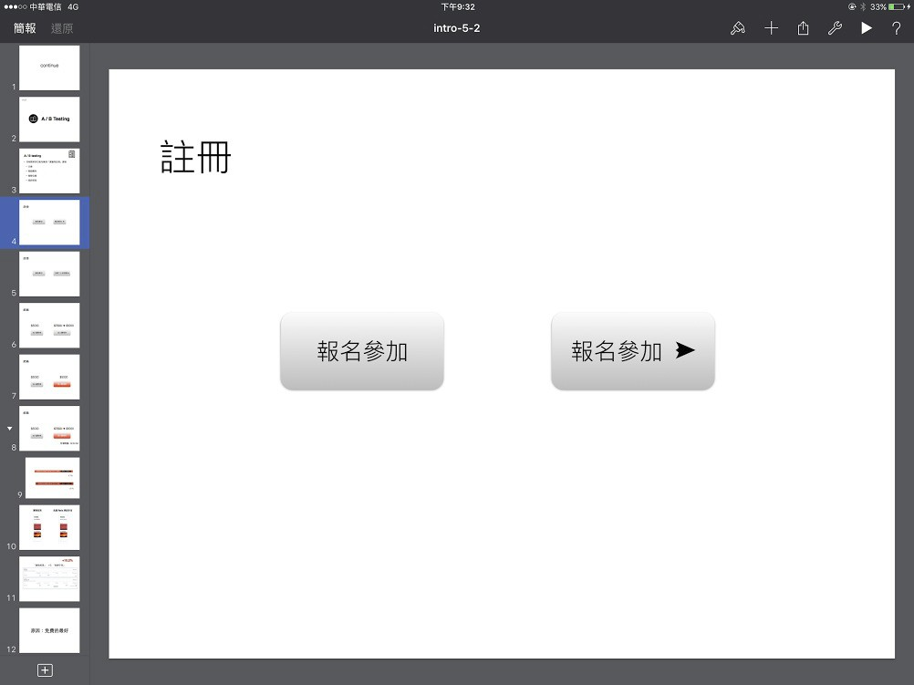
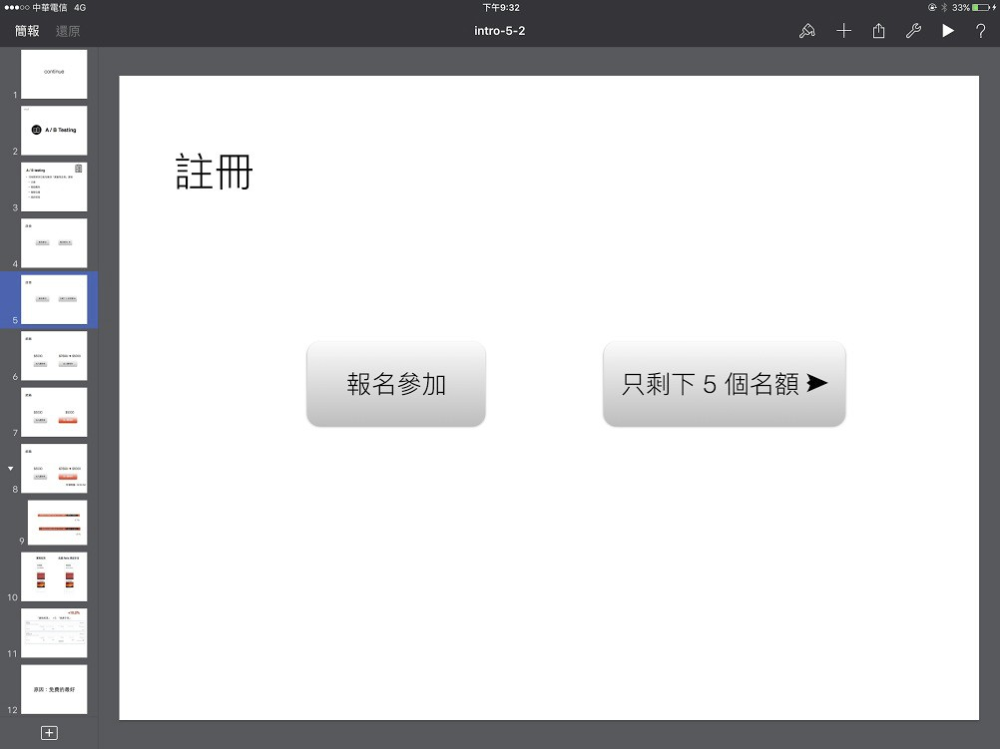
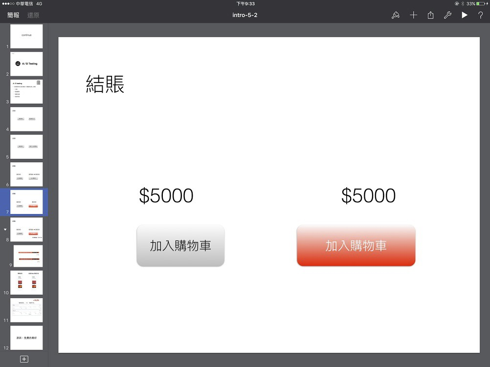
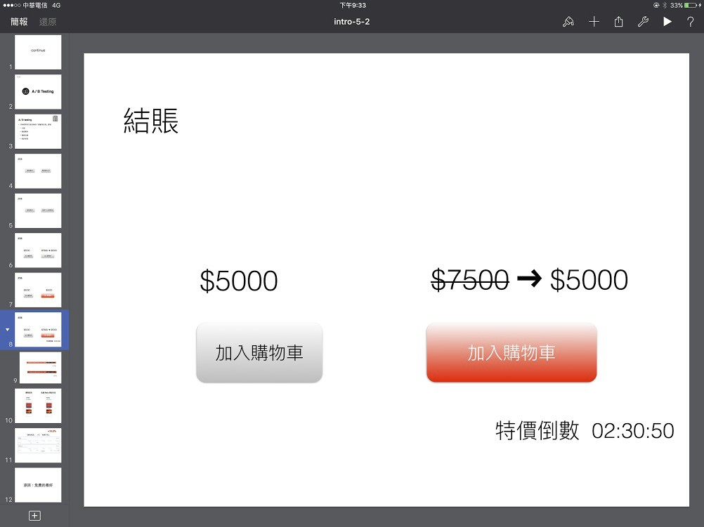
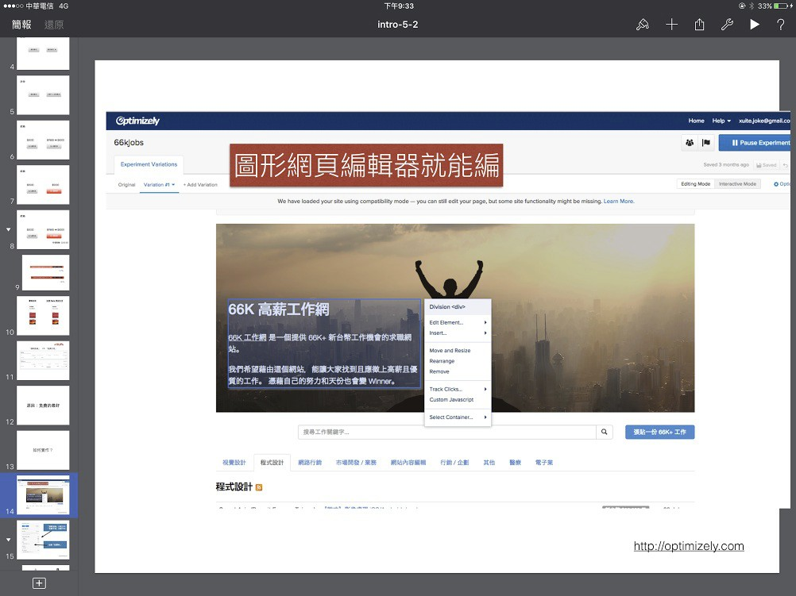
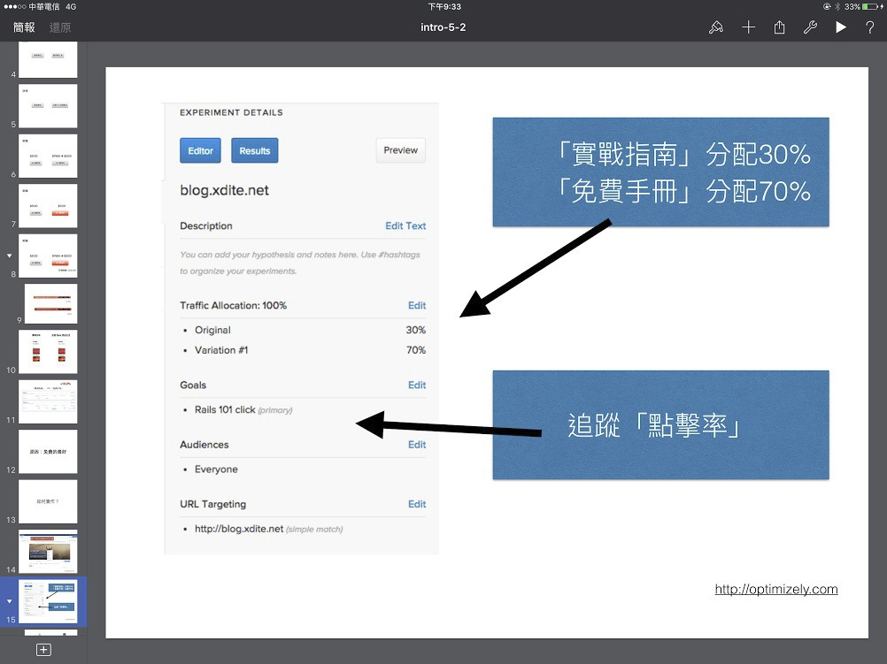
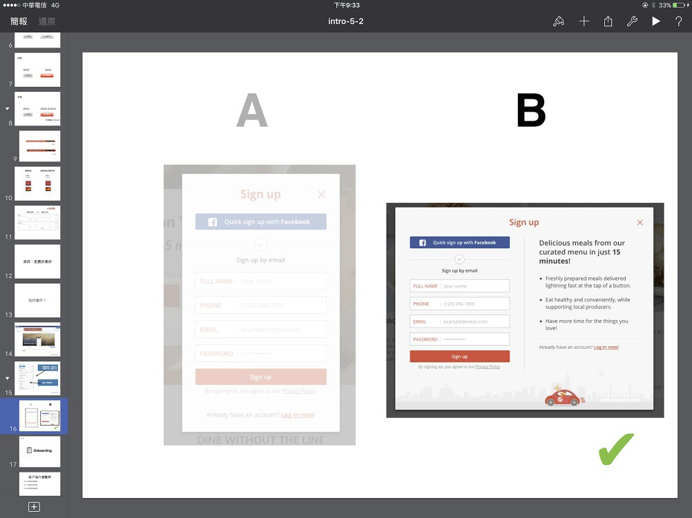

# 第5章：A/B Testing 找出「更」佳做法
===========================================

＠Opening：

對成長駭客來說，產品與服務的優化是永無止盡的，而且追求最佳化的過程是科學實證的，這是一個非常核心的精神，而這個精神的具體實踐就是A/B
Testing，無論是Landing
Page、註冊頁面、購買按鈕，對於成長駭客來說，這裡充滿了可以改進的細節，而且他們相信只要改進這些細節，去提高轉換率，那麼成長就可以在內部發生。

（跨兩頁，黑底白字）

## 第15課：追求進一步最佳化，多點小改進就會有大成長
--------------------------------------------------------

--- A/B Testing實作範例，你可以在網站的哪些地方做測試？

＠內文：

有了Landing Page，還可以怎麼變化？

接下來你可以引入工具，對Landing Page實作A/B
Testing，也就是測試看看怎麼樣的Landing Page對轉換率的效果是最好的。

A/B
Testing的意思就是實際做不同的測試，若更動版面上的排版方式，是否能讓顧客更願意執行你希望他執行的動作，轉化率更為提高。

A/B
Testing對成長駭客來說也是必要的一環，因為不同的產品、不同的情境、不同的顧客，沒有所謂唯一的最佳行銷作法，但成長駭客講求數據與證據，所以唯有透過A/B
Testing（也就是到底A方案好？還是B方案好？），實際試試看，才能找出對你最佳的解法。

通常我們可以在網站上的下列幾種地方，實作A/B Testing：

＠清單：

-   文案

-   按鈕位置

-   按鈕顏色

-   功能區塊

-   版面排版

尤其我們前面有說道，成長駭客希望不要用通靈的方式做行銷，所以當我有幾種方案，我不確定哪種方案最有效，那麼就利用可以操作的網頁來試試看吧！

更進一步的，你應該質疑自己或許目前的做法還不是最好的做法，有沒有可能改進一個什麼小地方，就帶來新的流量呢？A/B
Testing也是要幫你激發更好的網站流程或服務頁面的手段。

### 每個小細節，都可能提高轉換率

成長駭客關注細節的改進，並且認為每一個小細節的改進都可能提高轉換率，帶來新的成長。

例如一個單純的報名按鈕，你可能想說那不就是在按鈕上寫一個報名參加就好了嗎？

但是我就會去想，我想測試看看怎麼樣寫，更能吸引人去點擊這個按鈕呢？如果我在按鈕上加一個箭頭，會不會多吸引幾個百分比的人去點他？

試想看看，能夠提升幾個百分比的點擊率，如果你的流量是一萬人，那可能就是幾百到幾千個新客戶的產生！

{width="6.267716535433071in"
height="4.694444444444445in"}

＠圖：part5-1

發現加上箭頭可以增加點擊率後，我還不滿足，我進一步去想，有沒有可能有比報名參加更好的文案？

於是我進一步去測試看看如果把文案改成「只剩5個名額」加上「箭頭」，會不會點擊的比例又提高？事實也證明真的有提高。

但這裡的重點是A/B
Testing，也就是我必須要為了不斷還可以提高的轉換率去測試，測試後無用就換掉，測試後找到更好的方法，就可以保留下來，這就是那些新創服務可以持續成長的一個關鍵手段，他們不斷透過A/B
Testing來提高轉換率。

{width="6.267716535433071in"
height="4.694444444444445in"}

＠圖：PART5-2

### 用科學的測試，證明最佳的做法是什麼

而更關鍵的是，不是我覺得可以怎麼做就做，而是必須做A/B Testing。

下面到底按鈕是白色好？還是有顏色好？我覺得好像是有顏色好，傳統的行銷就會直接根據自己的想法修改。

但是A/B
Testing要求我們必須測試看看，讓一部分來客看到白色按鈕，讓一部分來客看到橘色按鈕，然後用實際的數據去確認，到底是哪一種比較好，並且把它保留下來。

{width="6.267716535433071in"
height="4.694444444444445in"}

＠圖：part5-3

成長駭客就是在這樣慢慢改進自身產品的使用流程的過程中，讓用戶愈來愈會中毒，愈來愈願意轉換。

這和傳統行銷只是把可能用戶找進來是不同的做法。

{width="6.267716535433071in"
height="4.694444444444445in"}

＠圖：part5-4

## 第16課：如何實作A/B Testing，幫你做實驗的線上工具
---------------------------------------------------------

--- 做A/B Testing也有快方法，用雲端服務快速在網站做測試

＠內文：

但是接下來問題來了，我知道要做A/B
Testing，但是難道我要自己手動修改與追蹤統計嗎？還是有沒有線上服務可以幫我做A/B
Testing？

這裡我要推薦大家可以使用「Optimizely」實作A/B
Testing。（網址：[[https://www.optimizely.com/）]{.underline}](https://www.optimizely.com/%EF%BC%89)

Optimizely的操作原理是在你的網頁上埋入Optimizely提供的JavaScript，然後開發者就可以進入Optimizely的後台，對你想A/B
Testing的網站版面區塊去做類似蓋台廣告效果的實驗，你可以控制顯示的次數或時間等細節，也就是可以讓你的網頁顯示不同的設計來測試效果。

{width="6.267716535433071in"
height="4.694444444444445in"}

＠圖：part5-8

比如說下面就是我測試的方式，我在網頁上要引誘來客去下載我的一本書，我不確定哪種描述效果最好，所以我用「Optimizely」來做兩種版本的蓋台效果。

我把描述是「實戰指南下載」的部分分配要顯示在30%的流量中，而描述是「免費手冊」的部分分配在其他70%的流量中。

然後「Optimizely」可以幫我追蹤兩種顯示方式帶來的點擊率。

{width="6.267716535433071in"
height="4.694444444444445in"}

＠圖：part5-9

透過「Optimizely」，不同的來客進入我的網站，就會顯示出不同的版面設計，而「Optimizely」後台會幫我追蹤兩種版本的轉換率，我最終就能知道哪一種方案比較好了。

{width="6.267716535433071in"
height="4.694444444444445in"}

＠圖：part5-10
