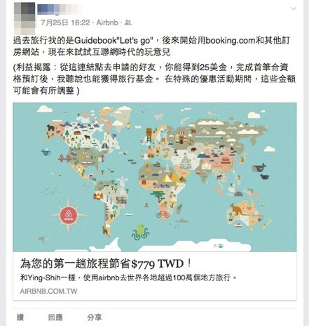
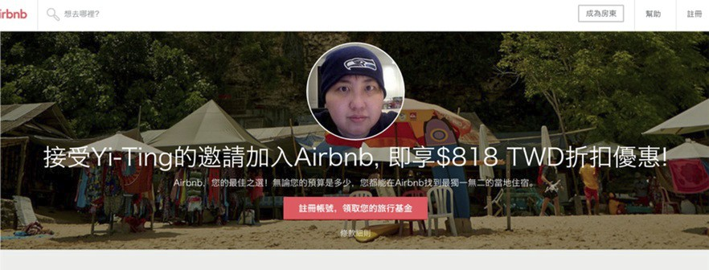
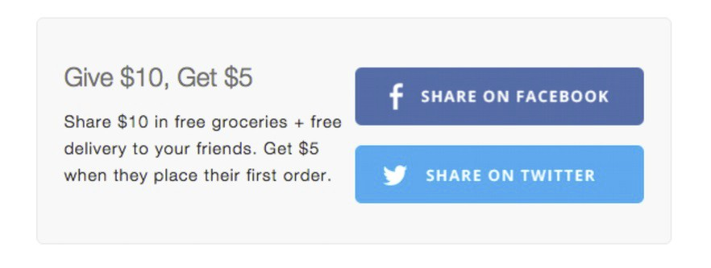
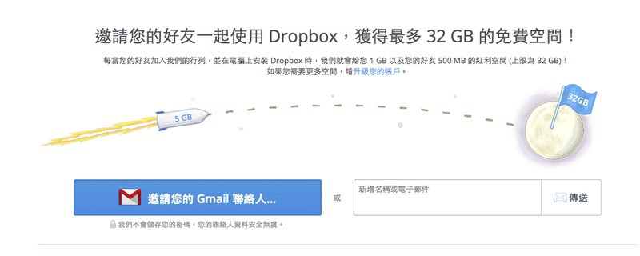
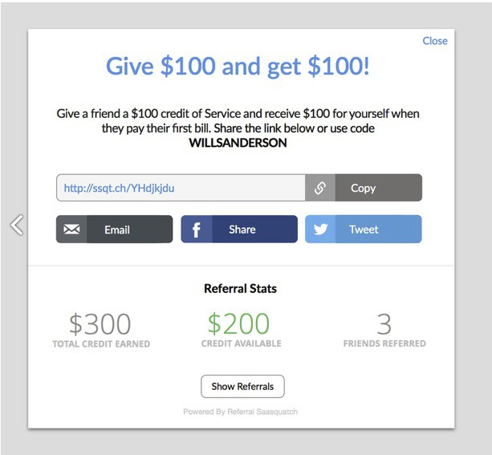
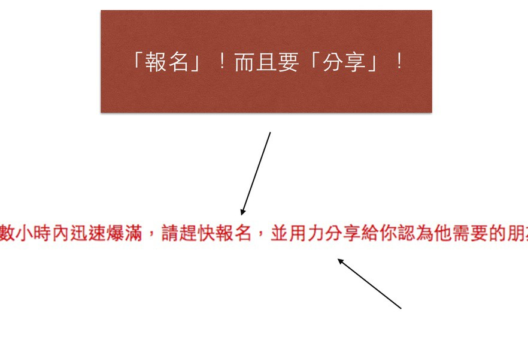
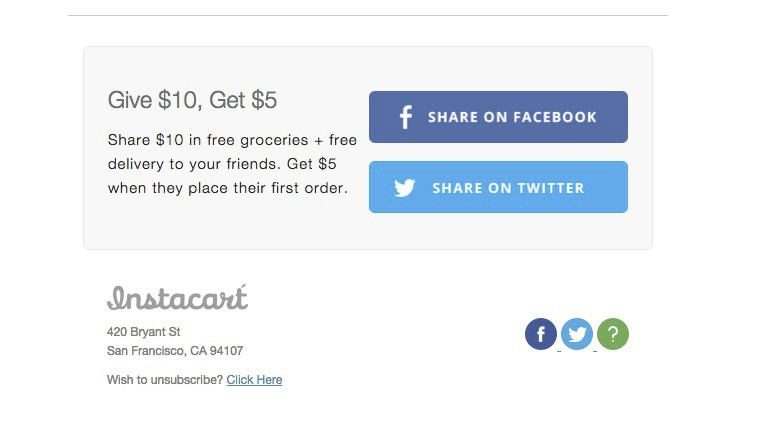
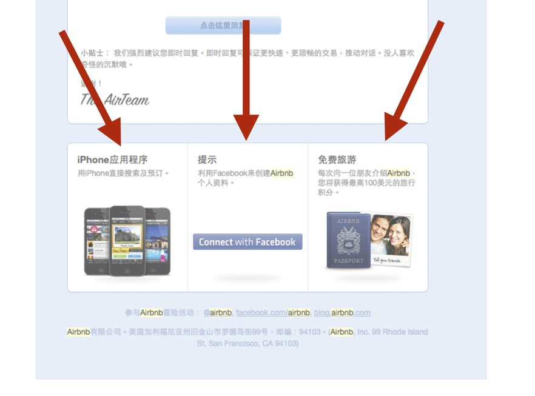
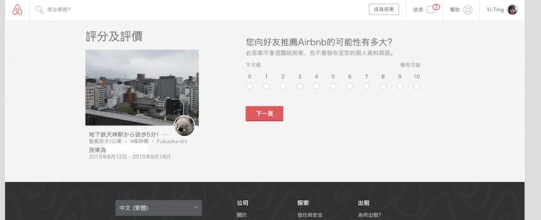

# 第9章：Referral與NPS，舊客戶是最好的行銷
================================================

很多人說成長駭客是一種節省成本的行銷手段，這或許不一定完全正確，但換個角度說，那是因為成長駭客關注的不是用更多的預算去找更多的新客戶，而是相對的回頭在舊客戶中找出可以成長、無法成長的關鍵因子，加以改進，達成更有效的內部成長手段。

（跨兩頁，黑底白字）

## 第25課：讓用戶推薦幫你成長，更值得信任的行銷手段
--------------------------------------------------------

--- 陌生人不會相信你的廣告所說的，但是會相信他的朋友推薦的

＠內文：

為什麼要做Referral（用戶推介）呢？

對陌生的客戶行銷，你的成本其實是很高的。

因為你是面對一片茫茫大海，那一大群Customer原本就不是你的目標客群。

要想辦法去洗腦他們，是很困難的事情。

即便是Facebook
，號稱有精準的客群行銷，但其花費對一般商家來說還是相當昂貴，因為除了打到精準的客群之外，你還需要對這一群陌生人重新投入信任的建立成本，與市場教育的成本。

所以當一般的事業站穩腳步後，擴張的手段會改而採取Referral（推介）的方式成長。

### 為什麼Refferal比傳統行銷更能獲得信任？

Refferal，用戶推介，他的原理建立在：

-   朋友用過
-   你相信朋友
-   推薦又有Discount
-   你相信別人測過的結果（特別是很貴的產品）

所以建立信任與市場教育成本相對較低。

### 知名的新創服務都喜歡使用Refferal手段

像Airbnb就很喜歡用這樣的招數行銷。

Airbnb的Referral
Program號稱一絕，所以你常常會在Facebook看到有人貼下面這種廣告，為了799元新台幣，就出賣了自己數位人格。

{width="4.59375in"
height="4.833333333333333in"}

＠圖：part9-1

然後你看到是信任的某朋友推介，你也放心的註冊下去。

為什麼Airbnb成長很快？一個主要原因就是他們實在超會玩Referral。

透過Discount跟一些心理招術，操作出很強的Referral效應。

{width="6.267716535433071in"
height="2.388888888888889in"}

＠圖：part9-2

## 第26課：Referral不是折扣，而是遊戲化的特殊效應
------------------------------------------------------

--- 不要只是給用戶錢，其實你最忠誠的顧客希望得到更多成就感

＠內文：

很多人認知的Referral
Program，通常是只限於這樣的形式：Give\$10、Get\$5，也就是透過單純的折價，提供推薦的人優惠。

{width="6.267716535433071in"
height="2.361111111111111in"}

＠圖：part9-3

但厲害的Growth團隊，通常會將Referral綁上Gamification（遊戲化），這樣才能將效應放大。

### Gamification：利用人們的強迫症

Dropbox幾年前成長速度飛快，他們也有很厲害的Referral
Program，而且他們的Referral頁 面特別有巧思。

{width="6.267716535433071in"
height="2.513888888888889in"}

＠圖：part9-4

這是火箭發射到月球的一個示意圖。

暗示著遊戲規則是：你可以邀請許多人加入Dropbox，
每邀請1個人，Dropbox就送你1GB空間當作獎勵，最多贈送32GB。

那麼有強迫症的人，看到這個圖，就會很想讓這台火箭飛到32GB的進度。

但是要一個一個手動邀請這麼多聯絡人不知道要邀到何時，剛好左下角有一個「出賣Gmail」的按鈕，按下去就省事了！

這就是為什麼Dropbox起飛很快的其中一個原因，他們的Referral
Program極大幅的增快了他們的成長速度。

### 把行銷的錢，獎勵給舊客戶做推薦！

Tesla在2015年中，也改採Referral 的方式銷售他們的車。

-   透過舊車主介紹去買車，新車主可以優惠 1000 美金。
-   舊車主也可以得到相當1000美金的credit。

Elon
Musk解釋為什麼他們改採Referral的原因是：「在直營店內每賣一台車，行銷成本大
約為美金\$2,000
。他們覺得把這\$2000省下來，回饋給新舊客戶，不但更省錢，也可以減少
原先的店鋪數量。」

這是相當聰明的作法，因為：

-   Tesla知道舊會員是誰（一群熱愛新科技的矽谷富豪）
-   Tesla想要瞄準的客群（熱愛新科技的有錢人），與舊會員有很緊密的關係
-   由舊會員當代言人與兼任Sales，再適合不過。
-   有什麼手段比有錢阿宅炫耀Tesla更有推坑殺傷力的呢？

### 用戶想要的不只是錢，而是更多的成就感

當然，Tesla不會希望舊會員「只幫忙推銷1台Tesla」，而且他的舊會員，也未必瞧得起\$1000美金的Credit，於是他們也對獎項加碼：

-   介紹別人成功買車5次，可受邀參加「新工廠開幕派對」。
-   介紹別人成功買車10次，享有限量車Tesla Model X SUV的購買資格。

要知道這群有錢人其實不在乎1000或是10000美金，他們在乎的是獨一無二的炫耀機會。

## 第27課：Multiple call to action，召喚顧客更多次的行動
-------------------------------------------------------------

--- 看矽谷最知名新創團隊如何最大化他們的用戶行動

＠內文：

還有一招常常配合Referral進行的技巧，叫做：「Multiple Call To Action」。

這就像是：神燈問你，你只能許一個願望，你要許什麼願望？為了將這個願望的效益最大
化，最好的回答是，我還要許三個願望。

### 消費者的CTA極其珍貴

我們知道Call To
Action其實可以半強迫的讓使用者去做一些事情，但是你只能叫他做一次的
事情，後續他就會覺得厭煩。

所以，這麼寶貴的機會，你應該一次叫他做多一點事情。

比如像這招，與其讓使用者推薦1次\$10，不如推薦10次賺\$100。

＠圖：part9-5

而其實我的報名頁面，也有藏類似陷阱：上面寫請趕快報名而且分享。

報名而且分享，這是兩個Call To Action。

＠圖：part9-6

如果你有訂閱Youtube上面的一些頻道主，其實你也會發現，他們喜歡在最後結尾說：請幫我按讚，並且分享。

Call To Action的機會無比珍貴，要好好把握。

### 看看矽谷知名公司怎麼做？

讓我們來看看Airbnb如何結合Multiple Call to Action與Referral Program。

一般矽谷的公司，在站穩腳步後，往往會實作Referral
Program。而且他們會在最大的曝光版位廣告這件事，例如每封信的Email
Footer。

矽谷一般服務系統信的footer長這樣：

{width="6.267716535433071in"
height="3.5416666666666665in"}

＠圖：part9-7

但是 Airbnb 的Footer長這樣：

{width="6.267716535433071in"
height="4.638888888888889in"}

＠圖：part9-8

他叫你做三件事：

-   下載iPhone app
-   多加利用Facebook登入
-   推銷他們的Referral Program

但你想第一個和第三個還算是Make Sense，第一個是說他們有iOS
App，用了體驗會更好。第三個叫你去分享給朋友，這個也Make Sense。

但是你一定不了解為什麼Airbnb鼓勵你用Facebook登入？這是因為Airbnb為了要製作Referral
Landing Page，沒有你的頭像，於是他們想要拐你用Facebook登入，取得你的頭
像！

如果你對Growth Hack有興趣的話。可以多多觀察拆解Airbnb在小地方設計上的巧思，他
們會儘量逮住小機會，去把推薦效益盡量的提高。

## 第28課：Net Promoter Score ( NPS )，做出有效的意見調查
--------------------------------------------------------------

--- 只要問對這一個問題，你就能找到無法成長的關鍵瓶頸

＠內文：

在Run Referral之前，我建議大家先去對你的顧客執行這個問卷調查，叫做「Net
Promoter Score
(NPS)」（淨推薦值，最流行的顧客忠誠度分析指標，一個客戶願意向其他人推薦你產品的數值）。

Net Promoter Score是什麼？如果用過 Airbnb
服務的人，在住宿後，Airbnb會寄出一個問卷問你，裡面有一題：你向好友推薦此服務的機會有多大？

NPS就是用這樣的方式，問你推薦服務這個服務的機率有多大？
請你從0-10給分數，並且要你寫「給這個分數的原因」，這樣的機制或許你看過，但它背後的意涵是什麼？

{width="6.267716535433071in"
height="2.5555555555555554in"}

＠圖：part9-9

### 有效找出「無法成長」的真正原因

有一些人做意見回饋時，喜歡用雷達圖問卷，評分等級1～5分，其實這很不準。因為除非你
的服務很爛，人家才會寫3分。比如你去王品，你就不敢填3分，因為你寫3分，他們就騷擾
你，那其實收不到效果。

但是問你「會不會推薦這個產品給朋友」，這個具體問題與回收回來的答案，都會很直觀，這就是問這個問題的目的。

### 如何衡量NPS的公式

NPS問卷中，分數的意義怎麼評量？我提供下面的方法。

＠清單：

-   9-10分是會推薦的人

-   7-8
    > 是中立者，對這個產品滿意，但不會主動推薦，除非有人問起。（因為小部分不是很滿意）

-   1-6 分是反推薦者，因為產品沒有給自己帶來實際的好處，或者體驗很差

計算方式是：

#### ( 推薦者人數 - 反推薦者人數）/ 總回收問卷人數的「百分比」

比如100個人繳交問卷，60人推薦，10人不推薦，30人中立，那麼NPS就是50%，也就是50分。

### 計算出NPS總分的意義

一般來說，有達到Product Market
Fit（還記得我們前面所說的PMF嗎？）的服務，NPS 會在20分以上。

＠清單：

-   30 分是Good

-   50 分是Great

-   70 分是Excellent

一般來說30分以上的產品就適合進行Referral Program了！

50分就是口碑極好。

70分以上只有一家常勝軍做到，叫Apple，已經不太科學了。

NPS被稱之為「The Ultimate
Question」，你只要用這一題就可以找出「你的服務爲什麼口碑散不出去」的真正原因。

客戶回饋意見很多也很雜，也許你對如何改進沒有頭緒。

但對於成長這個主題來說，其實你只要關注NPS這一題在「7-8
分」的顧客的意見，看這一塊就足夠。

因為他們是 「你口碑無法散不出去的原因」，一旦改進，就能夠真正成長。
